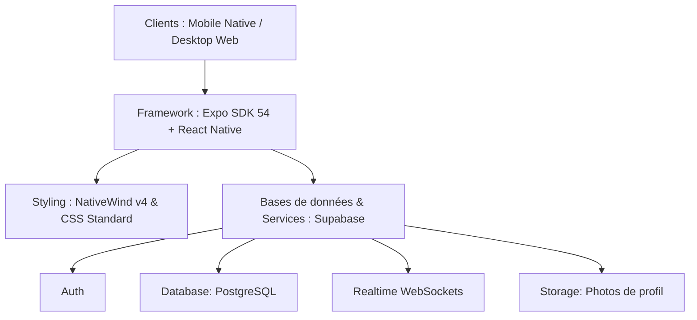

# 🗺️ Plan de Conception - Miara-Dia (BlaBla Car Gasy) 🚙🇲🇬

> [!CAUTION]
> ## 🚫 ZONE INTOUCHABLE — MOTEUR DE PAIEMENT SMS AUTOMATIQUE
> **NE JAMAIS MODIFIER** : `supabase/functions/sms-webhook/index.ts`, les tables `bookings` / `sms_logs` dans Supabase, la publication Realtime `supabase_realtime`, et le polling dans `app/ride/[id].tsx`.
> Ce système **fonctionne parfaitement en production**. ✅ **NE PAS Y TOUCHER.**

Ce document décrit la structure architecturale, les choix technologiques et les étapes de conception de l'application **Miara-Dia** pour garantir sa cohérence fonctionnelle sur **version téléphone** et **version ordinateur**.

---

## 🏗️ 1. Architecture Globale

L'application utilise une architecture moderne basée sur un stack hybride multi-plateforme :



### Stack Technique Précis
*   **Frontend :** Expo SDK 54, React Native & React Native Web.
*   **Navigation & Routage :** Expo Router v6 (routage basé sur le système de fichiers `app/`).
*   **Styling :** Tailwind CSS via NativeWind v4 (avec styles inline de secours pour les conteneurs superposés de date/autocomplete).
*   **Services Cloud Backend :** Supabase JS SDK.
*   **Cartographie :** Leaflet (intégré via React Native Webview) + tuiles gratuites vectorielles *CartoDB Voyager*.
*   **Calculs Locaux :** Dictionnaire de routage malgache pré-calculé (`lib/distancesMadagascar.ts`).

---

## 🗄️ 2. Schéma de Données & Sécurité (Supabase)

### Tables Principales
1.  **`profiles`** : Stocke les informations des utilisateurs (nom, prénom, téléphone, rôle, photo de profil, note moyenne, statut Super Driver).
2.  **`rides`** : Stocke les trajets publiés (lieu départ, lieu arrivée, date/heure départ, date/heure d'arrivée estimée, places disponibles, tarif principal, type véhicule, marque, taille bagage, galerie de toit, équipements, ID conducteur).
3.  **`stopovers`** : Liste des villes d'escale intermédiaires reliées à un trajet avec leurs tarifs respectifs.
4.  **`bookings`** : Réservations de trajets effectuées par les voyageurs (status: en attente, validé, annulé).
5.  **`payments`** : Historique des frais de réservation Mobile Money (MVola, Orange Money, Airtel Money) pour débloquer les numéros conducteurs.
6.  **`messages`** : Messages échangés dans les conversations de chat entre voyageurs et conducteurs.
7.  **`reviews`** : Notes 5 étoiles et commentaires laissés par les passagers après un trajet.

### Sécurité RLS (Row-Level Security)
*   Toutes les tables possèdent des politiques RLS pour empêcher la modification de données appartenant à d'autres utilisateurs.
*   *Exemple :* L'insertion d'un trajet (`rides`) exige que `auth.uid() = driver_id`.
*   Le gating du contact du chauffeur et de la messagerie est appliqué au niveau applicatif et base de données via le statut du paiement associé au couple (voyageur, trajet).

### Table Supplémentaire (Session 14)
8.  **`sms_logs`** : Journal de tous les SMS Mobile Money reçus (corps du SMS, référence extraite, montant, expéditeur, correspondance trouvée, nombre de réservations validées, horodatage).

---

## 🗂️ 3. Organisation du Code

```
miaradia-app/
├── app/                  # Dossier principal Expo Router
│   ├── (tabs)/           # Onglets principaux (Accueil, Publier, Messages, Voyages, Profil)
│   ├── admin/            # Espace de gestion des dépôts Kiosque et statistiques
│   ├── chat/             # Écran de discussion en temps réel
│   ├── driver/           # Écran du profil public d'un conducteur
│   ├── ride/             # Écran détaillé d'un trajet avec widget de réservation
│   └── _layout.tsx       # Configuration des thèmes et des WebSockets
├── components/           # Composants UI réutilisables (Modales, sélecteurs, étoiles)
│   ├── CustomAlert.tsx   # Modale d'alerte premium animée (S14)
│   └── PaymentModal.tsx  # Modale de sélection Mobile Money
├── constants/            # Données géographiques de Madagascar (Provinces, Régions, Communes)
│   └── locations/
├── hooks/                # Hooks React réutilisables (sessions, requêtes)
├── lib/                  # Utilitaires (client Supabase, formateur de prix, OSM, suggestions d'itinéraires)
├── utils/                # alert.ts (intercepteur CustomAlert)
├── supabase/             # Edge Functions Supabase
│   └── functions/
│       └── sms-webhook/  # Validation automatique SMS Mobile Money (S14)
└── scripts/              # Scripts utilitaires de parsing de données
```

---

## 🚀 4. Plan de Développement par Phases

### Phase 1 : Consolidation UX & Core (Terminée ✅)
*   Moteur de recherche tolérant multi-termes à Madagascar.
*   Design dual-pane adaptatif Desktop & Mobile.
*   Chat temps réel et notation des conducteurs.
*   Politique d'inscription stricte (Vrai Visage, Rôle) et **Algorithme Anti-Fraude linguistique (Bio)** pour bloquer le contournement de la passerelle de paiement (S14).

### Phase 2 : Automatisation & Instantanéité *(RÉALISÉ ✅)*
*   **Validation SMS Mobile Money *(RÉALISÉ - S16/S17)* :** Création d'une "Passerelle SMS" Native Android. L'application lit en arrière-plan les SMS MVola/Orange/Airtel entrants, compare avec les réservations en attente via une syntaxe RegExp ajustée au format malgache réel, et déverrouille automatiquement le contact chauffeur. Implémentation du système `PermissionsAndroid.request` (S17) et d'un double polling (Client & Admin) pour un rafraîchissement 100% sans contact.
*   **Déploiement Web Vercel *(RÉALISÉ - S14)* :** Application en production sur https://miaradia-app.vercel.app avec CI/CD automatique (GitHub → Vercel) et gestion de l'historique de routage (S17).
*   **Alertes Premium *(RÉALISÉ - S14)* :** Composant `CustomAlert` modal animé déployé sur toute l'application.
*   **Notifications Push (Expo Notifications) *(RÉALISÉ - S20)* :** Intégration de `expo-notifications` pour alerter le passager instantanément sur son téléphone lorsque son paiement Mobile Money est validé en arrière-plan.
*   **Intégration API MVola Officielle *(PROCHAINE ÉTAPE)* :** Obtenir un compte business Telma pour une validation encore plus fiable que la solution SMS Gateway.

### Phase 3 : Fiabilité & Mode Offline
*   **Cache Local SQLite/AsyncStorage :** Mettre en cache local les détails du billet réservé et le contact du chauffeur pour y avoir accès sur la route nationale en zone d'ombre (sans réseau).
*   **Vérification CIN (KYC) :** Formulaire de téléversement et processus d'approbation d'identité pour certifier officiellement les conducteurs.

### Phase 4 : Croissance & Diversification
*   **Application Android native (APK) *(RÉALISÉ - S14)* :** Configuration `eas.json` et génération du fichier `.apk` via EAS Build pour distribution directe. Intègre les permissions `RECEIVE_SMS` et `READ_SMS` vitales.
*   **Programme de Fidélité** : Récompenses pour les passagers fréquents (crédits gratuits).
*   **Abonnements & Monétisation Alternée** : Plans hebdomadaires et mensuels pour accès illimité. Options de "Boost d'Annonce" payantes pour les chauffeurs.
*   **Diversification des Usages** :
    *   *Trajets Intra-District / Taxi de Quartier :* Trajets domicile-travail.
    *   *Sortie en Famille / Privatisation :* Utilisateurs cherchant une location de véhicule avec ou sans chauffeur.
    *   *Publication de Location :* Parc automobile de location payant 1 000 Ar / 24h.-

## 🌐 5. Infrastructure de Déploiement

| Service | Usage | URL |
|---|---|---|
| **Vercel** | Hébergement Web + CI/CD | https://miaradia-app.vercel.app |
| **GitHub** | Code source + versioning | https://github.com/Aintsoa-ai/miaradia-app |
| **Supabase** | Backend + DB + Auth + Edge Functions | https://yqttaeukmnstyxbabkqz.supabase.co |
| **SMS Gateway** | App Android sur téléphone admin | Gratuit |

*Dernière mise à jour : **8 Juin 2026** - Session 20*
