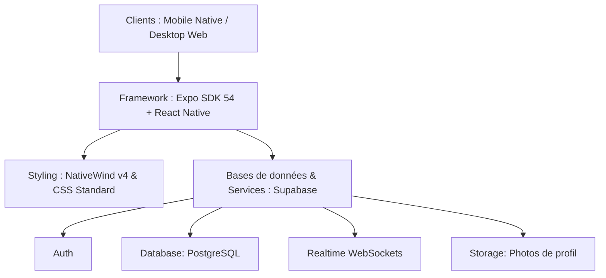

# 🗺️ Plan de Conception - Miara-Dia (BlaBla Car Gasy) 🚙🇲🇬

Ce document décrit la structure architecturale, les choix technologiques et les étapes de conception de l'application **Miara-Dia** pour garantir sa cohérence fonctionnelle sur **version téléphone** et **version ordinateur**.

---

## 🏗️ 1. Architecture Globale

L'application utilise une architecture moderne basée sur un stack hybride multi-plateforme :



### Stack Technique Précis
*   **Frontend :** Expo SDK 54, React Native & React Native Web.
*   **Navigation & Routage :** Expo Router v6 (routage basé sur le système de fichiers `app/`).
*   **Styling :** Tailwind CSS via NativeWind v4 (avec styles inline de secours pour les conteneurs superposés de date/autocomplete).
*   **Services Cloud Backend :** Supabase JS SDK.
*   **Cartographie :** Leaflet (intégré via React Native Webview) + tuiles gratuites vectorielles *CartoDB Voyager*.
*   **Calculs Locaux :** Dictionnaire de routage malgache pré-calculé (`lib/distancesMadagascar.ts`).

---

## 🗄️ 2. Schéma de Données & Sécurité (Supabase)

### Tables Principales
1.  **`profiles`** : Stocke les informations des utilisateurs (nom, prénom, téléphone, rôle, photo de profil, note moyenne, statut Super Driver).
2.  **`rides`** : Stocke les trajets publiés (lieu départ, lieu arrivée, date/heure départ, date/heure d'arrivée estimée, places disponibles, tarif principal, type véhicule, marque, taille bagage, galerie de toit, équipements, ID conducteur).
3.  **`stopovers`** : Liste des villes d'escale intermédiaires reliées à un trajet avec leurs tarifs respectifs.
4.  **`bookings`** : Réservations de trajets effectuées par les voyageurs (status: en attente, validé, annulé).
5.  **`payments`** : Historique des frais de réservation Mobile Money (MVola, Orange Money, Airtel Money) pour débloquer les numéros conducteurs.
6.  **`messages`** : Messages échangés dans les conversations de chat entre voyageurs et conducteurs.
7.  **`reviews`** : Notes 5 étoiles et commentaires laissés par les passagers après un trajet.

### Sécurité RLS (Row-Level Security)
*   Toutes les tables possèdent des politiques RLS pour empêcher la modification de données appartenant à d'autres utilisateurs.
*   *Exemple :* L'insertion d'un trajet (`rides`) exige que `auth.uid() = driver_id`.
*   Le gating du contact du chauffeur et de la messagerie est appliqué au niveau applicatif et base de données via le statut du paiement associé au couple (voyageur, trajet).

---

## 🗂️ 3. Organisation du Code

```
miaradia-app/
├── app/                  # Dossier principal Expo Router
│   ├── (tabs)/           # Onglets principaux (Accueil, Publier, Messages, Voyages, Profil)
│   ├── admin/            # Espace de gestion des dépôts Kiosque et statistiques
│   ├── chat/             # Écran de discussion en temps réel
│   ├── driver/           # Écran du profil public d'un conducteur
│   ├── ride/             # Écran détaillé d'un trajet avec widget de réservation
│   └── _layout.tsx       # Configuration des thèmes et des WebSockets
├── components/           # Composants UI réutilisables (Modales, sélecteurs, étoiles)
├── constants/            # Données géographiques de Madagascar (Provinces, Régions, Communes)
│   └── locations/
├── hooks/                # Hooks React réutilisables (sessions, requêtes)
├── lib/                  # Utilitaires (client Supabase, formateur de prix, OSM, suggestions d'itinéraires)
└── scripts/              # Scripts utilitaires de parsing de données
```

---

## 🚀 4. Plan de Développement par Phases

### Phase 1 : Consolidation UX & Core (Terminée ✅)
*   Moteur de recherche tolérant multi-termes à Madagascar.
*   Design dual-pane adaptatif Desktop & Mobile.
*   Chat temps réel et notation des conducteurs.
*   Politique d'inscription stricte (Vrai Visage, Rôle).

### Phase 2 : Automatisation & Instantanéité (Prochaine Étape)
*   **Intégration Agrégateur Mobile Money :** Remplacer le traitement manuel admin des dépôts en Kiosque par une API de paiement (ex. Bizao ou APIs directes) pour valider les transactions et débloquer les contacts instantanément.
*   **Notifications Push (Expo Notifications) :** Alerter les utilisateurs hors-app des nouveaux messages de chat et de la confirmation des réservations.

### Phase 3 : Fiabilité & Mode Offline
*   **Cache Local SQLite/AsyncStorage :** Mettre en cache local les détails du billet réservé et le contact du chauffeur pour y avoir accès sur la route nationale en zone d'ombre (sans réseau).
*   **Vérification CIN (KYC) :** Formulaire de téléversement et processus d'approbation d'identité pour certifier officiellement les conducteurs.
